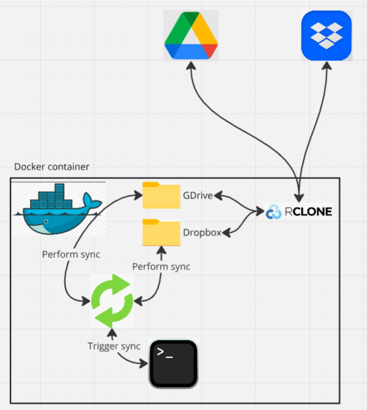
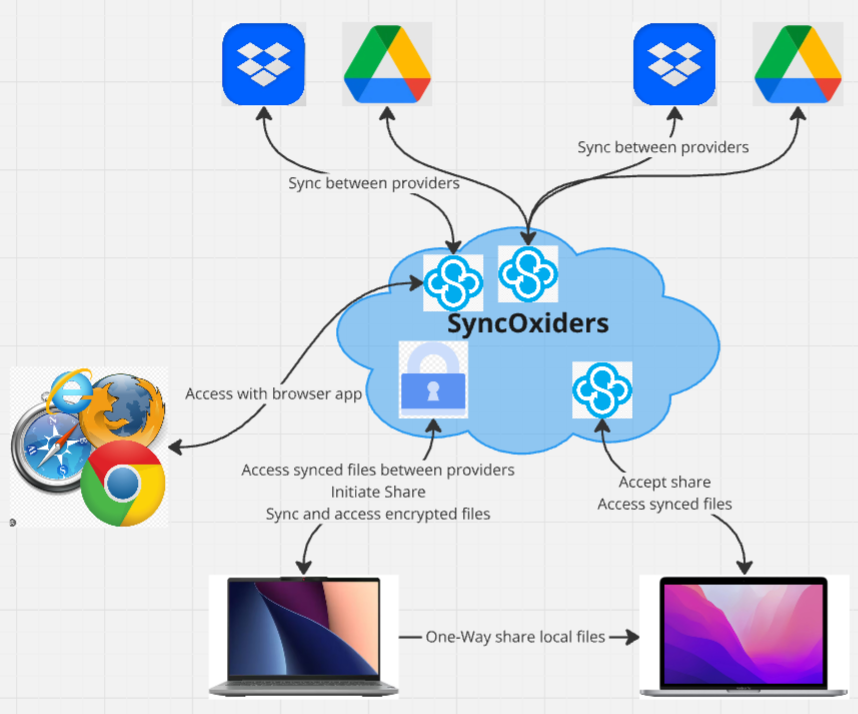
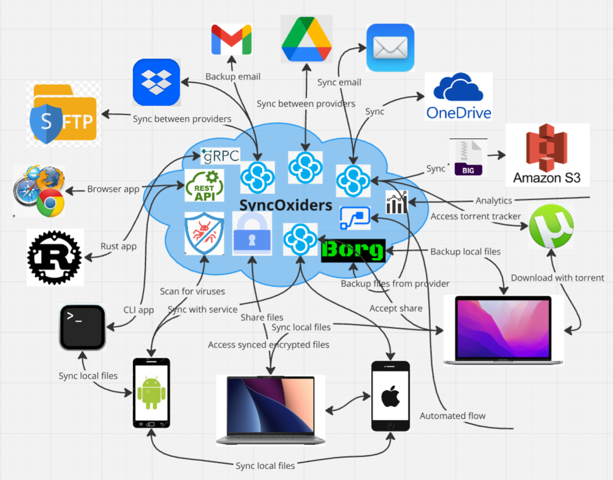

#  SyncOxiders

Cloud file and email Sync, file Sharing, Backup and Encryption solution written in Rust.

The purpose of this project is to offer an easy and reliable way to sync files and emails between multiple providers and share files between multiple storage providers (like Google Drive, Dropbox, S3, SFTP servers, ...) and local files. Also simple way for backup of your files and emails and encryption. 
It offers real time sync (from simple Copy One-way to Two-way Sync) all handled in the cloud, without the explicit need of local clients.

> [!WARNING]  
> For now it's in PoC phase, it has some or the core components, like encryption, basic Google Drive client and a basic [CLI app](website/pages/poc-demo.md#using-cli).

It's using [rencfs](https://github.com/radumarias/rencfs) for encryption and [gdrive-rs](https://github.com/radumarias/gdrive-rs) for accesing Google Drive.

> [!IMPORTANT]  
> It you could take this [**SURVEY**](https://forms.gle/qgnWBJhzCpzPLSmv5) to express your opinion about the current solution and offer your opinion on what features you would want from a service like this it would help a lot.

> [!NOTE]  
In many cases we'll use present tense for several functionality, even though they are not yet implemented, it's used to give an idea of what the system could be.

[What's with the name](website/pages/name.md)

# PoC

You can see more [details](website/pages/poc-demo.md) on what's working now, play with the [CLI app](website/pages/poc-demo.md#using-cli) and see a short [demo](https://www.youtube.com/watch?v=JHQC1XpCzQw).

Working on having these in up to 2 months:
- in `Docker` ability to sync 2 folders in the filesystem
- run `rclone` in `Docker` and mount `Google Drive` and `Dropbox` or `MS OneDrive` in 2 folders
- from CLI trigger a sync which will make a Two-Way sync between the folders, first sync will do a union between the 2, no delete or rename will be performed
- do some changes in both local folders and trigger a sync, from now on it will propagate deletes and renames also
- do some changes on the remotes, trigger a sync and make sure changes are propagated in both local folders and on remotes
- save files encrypted using `rencfs`
  - this will save encrypted data on the mount points of `rclone` and expose them with `FUSE`

# MVP

It would be possible to have something in about 6 months with this functionality:
- integration with `Google Drive` and `Dropbox` or `MS OneDrive`
- Sync between the two
- Share files from providers with another user
- browser app with basic functionality like:
  - adding providers
  - setup sync rules
  - share between providers
- some basic functionality of sharing local files, no sync between them
- encryption

For this phase we will still be using `rclone` to access providers, this is to simplify the access. But for future plan is to:
- implement our own clients that will directly communicate with the providers API
- receive changes in close to real-time
- store the changes in `Kafka` and window them (group them) with `Flink`
- feed them as changes tree to the `files tree merge` algorithm which will do the merge, resolve conflicts and applying changes to the other providers or local files

# The big picture

This is what it's planned to have in the end.

[Use cases](website/pages/use-cases.md)

[Features](website/pages/features.md)

[What separates it from other products](website/pages/compare.md)

[How it works](website/pages/how-it-works.md)

[Tech stack](website/pages/stack.md)
